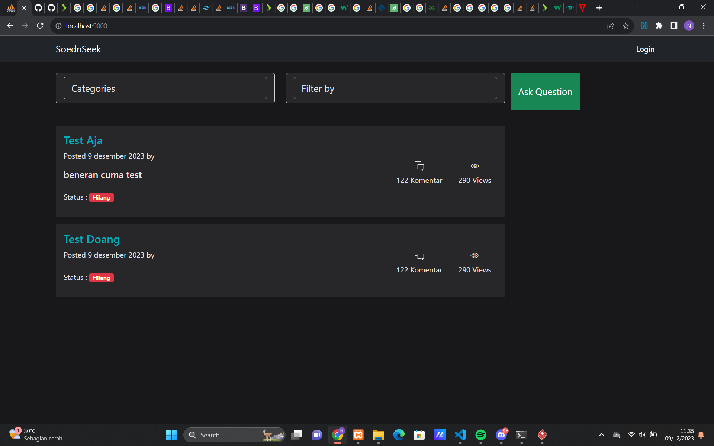
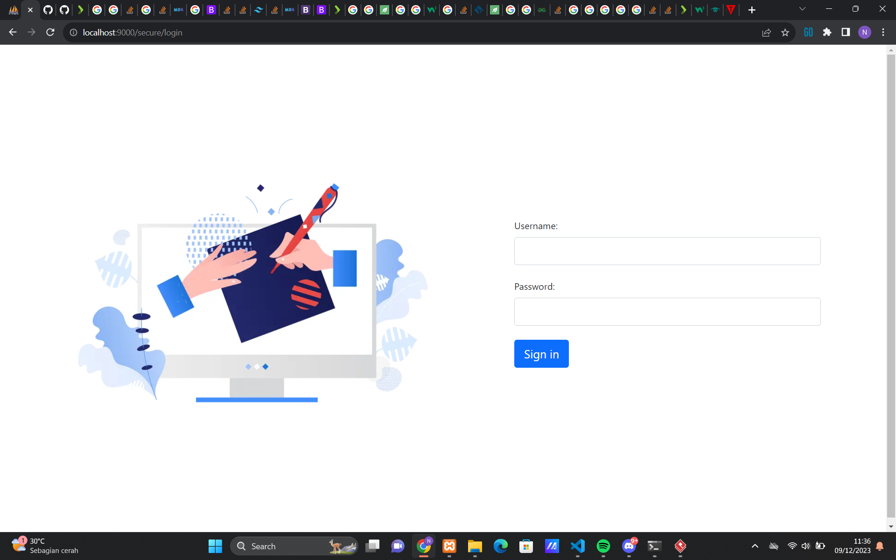
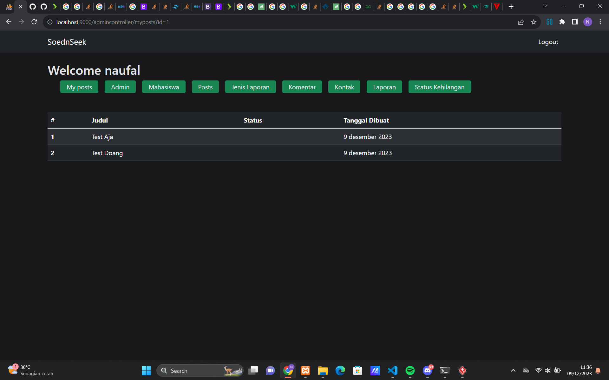
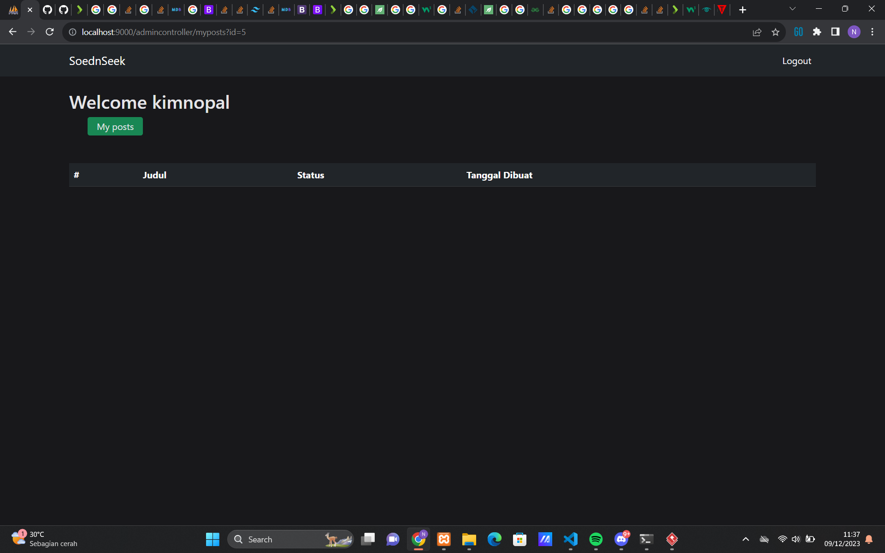
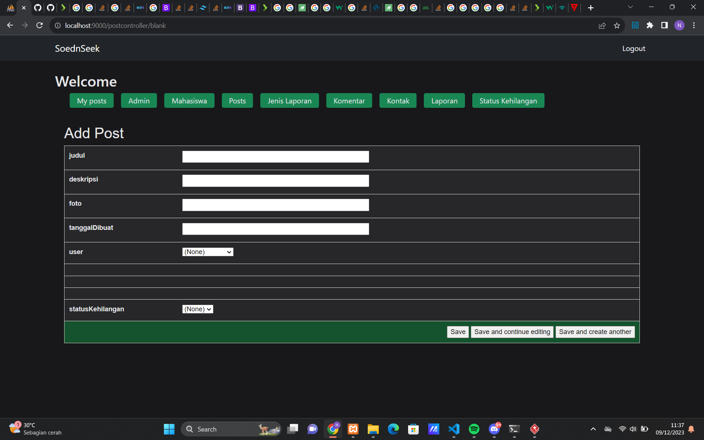
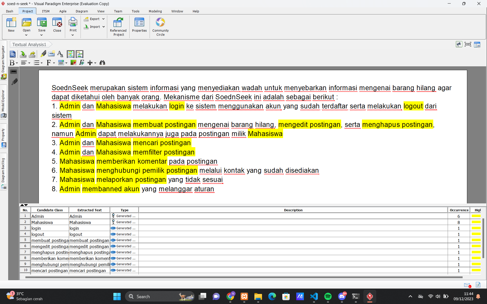

# soed-n-seek
SoednSeek merupakan sistem informasi yang menyediakan wadah untuk menyebarkan informasi mengenai barang hilang agar dapat diketahui oleh banyak orang.

# Fitur
- multi user (Admin, Mahasiswa)
- Aksi Admin
  - login, logout
  - membuat, mengedit, menghapus postingan
  - search postingan
  - membanned akun
- Aksi Mahasiswa
  - login, logout
  - membuat, mengedit, menghapus postingan
  - search postingan
  - komentar pada postingan
  - melaporkan postingan
  - menghubungi pemilik postingan

# Preview Project
1. Home Page
   
   
2. Login Page
   
   
3. Admin Page
   
   
4. Mahasiswa Page
   
   
5. Create Post Page
   

# Diagram
1. Textual Analysis
   

2. Use Case Diagram
   

3. Class Diagram
   

4. Sequence Diagram
   - User Login
   

   - User Mengelola Postingan
   

   - Mahasiswa Melaporkan Postingan
   
